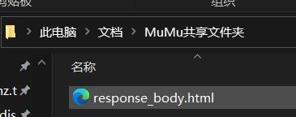

# 学习通考试题获取

## 准备工作

> Android7以后，系统不再信任用户级的证书，只信任系统级的证书  
> 所以最好找个低版本虚拟机  
> 其他方法请自测

安卓虚拟机，里面安装 `httpCanary`、`学习通`  
我这里使用的是网易的 `MuMu模拟器`

## 目录结构

~~~
├─img                   操作演示图片
├─2docx.js              将topic.json中的数据转为word文档
├─export.js             在浏览器端执行的脚本
├─index.js              将topic1.json中的数据导入到topic.json中
├─topic.json            最终保留的数据
├─topic1.json           每次获取到的新数据
~~~

## 使用方法

1. clone本仓库
2. 在项目目录下运行 `npm i`
3. 打开模拟器中的 `HttpCanary` 和 `学习通`
   1. 黄鸟设置只抓包学习通
    
   2. 打开学习通中考试界面，必须做完，对不对无所谓
    
   3. 点击 `查看试卷详情`、再点击 `查看详情`
    
    
   4. 返回黄鸟
   
   5. 点进去点击右上角保存 `保存响应体`
   
   6. 在sd卡根目录下的 `HttpCanary/download` 下找到保存的文件
   7. 将其移动到电脑上在浏览器中打开，在浏览器中打开控制台输入 `export.js` 中的代码
   
   
   8. 右键复制输出的对象，粘贴到 `topic1.json` 文件中
   
   9. 运行 `index.js`
